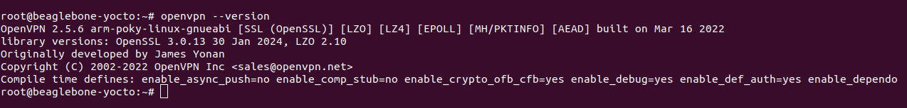

---

# Building Yocto Project Image with OpenVPN

This document outlines the steps taken to build a Yocto Project image for BeagleBone boards that includes OpenVPN, allowing the device to act as a VPN client. Throughout the process, we encountered and resolved specific issues, particularly concerning layer compatibility and configuration.

## Prerequisites

- Compile and run existing docker container using vscode extension.
- Basic knowledge of terminal and command-line operations.

## Steps Overview

1. **Prepare the Environment**
2. **Clone `meta-openembedded`**
3. **Configure `bblayers.conf`**
4. **Modify `local.conf`**
5. **Build the Image**
6. **Verification**

## Detailed Instructions

### 1. Prepare the Environment

Ensure you have the Yocto Project's `poky` directory set up for the `kirkstone` release. This serves as the base for our project.
check note `building-image.md`

### 2. Clone `meta-openembedded`

Due to a compatibility issue with the `kirkstone` branch in `meta-openembedded`, we use the `kirkstone-next` branch. Clone it into `/yocto/sources/`.

```bash
cd /yocto/sources/
git clone -b kirkstone-next https://github.com/openembedded/meta-openembedded.git
```

Note: The `kirkstone` branch had compatibility issues, specifically with series names not matching, necessitating our switch to `kirkstone-next`.

### 3. Configure `bblayers.conf`

Add the necessary layers from `meta-openembedded` to your build's `bblayers.conf`, located in `/yocto/build/conf/`. This includes `meta-oe`, `meta-networking`, and `meta-python`, which are required for OpenVPN and its dependencies.

```plaintext
BBLAYERS ?= " \
  /yocto/poky/meta \
  /yocto/poky/meta-poky \
  /yocto/poky/meta-yocto-bsp \
  /yocto/sources/meta-openembedded/meta-oe \
  /yocto/sources/meta-openembedded/meta-networking \
  /yocto/sources/meta-openembedded/meta-python \
"
```

### 4. Modify `local.conf`

In your `local.conf` file, append OpenVPN to the image installation list. This ensures OpenVPN is included in the build.

```plaintext
IMAGE_INSTALL:append = " openvpn"
```

### 5. Build the Image

With all configurations in place, compile the image using Bitbake.

```bash
cd /yocto/build
bitbake core-image-minimal
```

## 6. Verification

After the build process completes, it's essential to verify that OpenVPN has been successfully included in the image. This verification can be done by examining the image manifest file, which lists all packages installed in the image.

### Checking OpenVPN Installation in the Manifest

Navigate to the directory containing the built image and its manifest file:

```bash
cd /yocto/build/tmp/deploy/images/beaglebone-yocto
```

Use the `cat` command combined with `grep` to search for OpenVPN in the manifest file:

```bash
cat core-image-minimal-beaglebone-yocto.manifest | grep openvpn
```

If OpenVPN has been successfully included in your build, this command will output an entry for OpenVPN, similar to:

```
openvpn cortexa8hf_neon 2.5.6
```

This output confirms that OpenVPN, version 2.5.6 in this example, is part of the built image, ready to be deployed on your BeagleBone board.


### Checking OpenVPN Installation in the device

Upon deploying the image to your device, you can verify OpenVPN's installation by running:

```bash
openvpn --version
```

This command should output the OpenVPN version installed, indicating successful inclusion in your Yocto Project image.

## Conclusion

This guide walked through the process of building a Yocto Project image with OpenVPN included, addressing specific challenges encountered along the way. With this setup, your BeagleBone board is equipped to establish VPN connections, enhancing its connectivity and security options.


