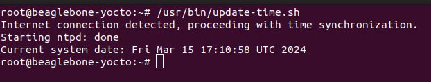

# NTP Configuration for BeagleBone Black Yocto Project

This README outlines the steps to configure and use Network Time Protocol (NTP) on the BeagleBone Black running a Yocto-based Linux distribution. NTP is essential for ensuring that your system maintains accurate time, which is crucial for many applications.


## Adding NTP to Your Yocto Image

To ensure NTP is included in your Yocto project build by default, follow these steps:

1. **Modify Your Local Configuration (`local.conf`):**
   Add `ntp` to the `IMAGE_INSTALL` variable by appending the following line to your `local.conf` file, typically found in `build/conf/local.conf`:
   ```bitbake
   IMAGE_INSTALL:append = " ntp"
   ```

2. **Including NTP in Your Image Recipe:**
   If you have a custom image recipe, you can directly add `ntp` to the list of packages to install. Add the following line to your image recipe (`.bb` or `.bbappend` file):
   ```bitbake
   IMAGE_INSTALL += "ntp"
   ```

By including NTP in your Yocto project and configuring it as outlined, you ensure that your BeagleBone Black's system time is accurate, facilitating reliable operation for time-sensitive applications.


## Updating NTP Servers in `/etc/ntp.conf`

1. Ensure your BeagleBone Black is connected to the internet.
2. Open the `/etc/ntp.conf` file in a text editor. You might use `nano` or `vi`:
   ```bash
   nano /etc/ntp.conf
   ```
3. Update the NTP server entries in the file. Add servers close to your geographic location for better accuracy. Example configuration:
   ```
   server 0.pool.ntp.org iburst
   server 1.pool.ntp.org iburst
   server 2.pool.ntp.org iburst
   server 3.pool.ntp.org iburst
   ```
   The `iburst` keyword speeds up the initial synchronization.
4. Save the changes and exit the text editor.

## Starting or Restarting `ntpd`

After updating the NTP server configuration, start or restart the NTP daemon for the changes to take effect:

```bash
/etc/init.d/ntpd start
```

This command stops the running NTP daemon and starts it again with the new configuration.

## Check date 

After the NTP daemon is started you can verify if the time has been updated by typing date command, it can take a couple of seconds to synchronize:

```bash
root@beaglebone-yocto:~# date
Fri Mar  9 12:44:39 UTC 2018
root@beaglebone-yocto:~# date
Thu Mar 14 14:59:42 UTC 2024
```


## Yocto Recipe:

To automate the previously described process, a recipe has been developed within the directory [`sources/meta-custom/recipes-custom/ntp-scripts`](../sources/meta-custom/recipes-custom/ntp-scripts). This recipe facilitates automation by:

- Installing the script [update-time.sh](../sources/meta-custom/recipes-custom/ntp-scripts/files/update-time.sh), which checks for internet connectivity and initializes the NTP service.

Additionally, a patch for the NTP recipe has been introduced at [`/sources/meta-custom/recipes-support/ntp/ntp_%.bbappend`](../sources/meta-custom/recipes-support/ntp/ntp_%.bbappend). This patch substitutes an existing configuration file with a version that specifies certain NTP servers, located at `/etc/ntp.conf`.

It's crucial to highlight the importance of implementing the NTP protocol, particularly in scenarios where a Real-Time Clock (RTC) is absent. Ensuring accurate time synchronization is essential for services relying on internet connectivity, such as VPN or SSH, to function correctly.

## Script Execution : 
Below there is an image showing the script being called and successfully updating date. 

