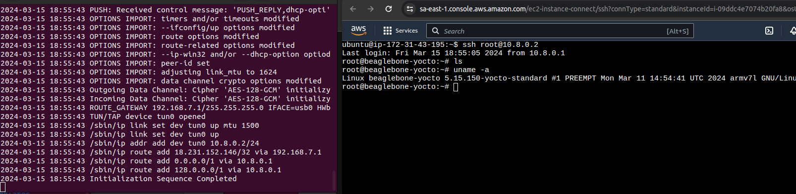
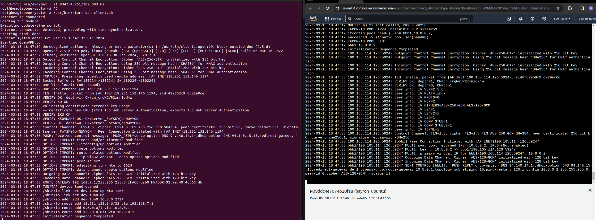

# OpenVPN Server - Client Setup Guide

This guide provides detailed instructions for setting up an OpenVPN server using an automated installation script, configuring a BeagleBone Black as a VPN client, and considerations for using a BeagleBone Black as an OpenVPN server. It is designed to simplify the deployment of OpenVPN for securing remote access to and from multiple client devices over the internet.

## Table of Contents

- [Introduction](#introduction)
- [Downloading and Executing the OpenVPN-Install Script](#downloading-and-executing-the-openvpn-install-script)
- [Setting Up the OpenVPN Server](#setting-up-the-openvpn-server)
- [Configuring the BeagleBone Black as a Client](#configuring-the-beaglebone-black-as-a-client)
- [Establishing an SSH Session Over VPN](#establishing-an-ssh-session-over-vpn)
- [Demonstrating a Successful Connection](#demonstrating-a-successful-connection)
- [Using BeagleBone Black as a Server](#using-beaglebone-black-as-a-server)
- [Benefits of This Implementation](#benefits-of-this-implementation)

## Introduction

The `openvpn-install` script is a powerful tool designed for the rapid deployment of an OpenVPN server. It automates the installation, configuration, and key generation processes, making it an ideal solution for fast testing and large-scale deployments. This guide focuses on using this script for setting up an OpenVPN server on an Amazon EC2 instance and connecting a BeagleBone Black as a client.

## Downloading and Executing the OpenVPN-Install Script

1. **Download the Script**:
    ```bash
    wget https://git.io/vpn -O openvpn-install.sh

    ```
    Replace the URL with the actual location of the `openvpn-install` script.

2. **Make the Script Executable**:
    ```bash
    chmod +x openvpn-install.sh
    ```

3. **Execute the Script**:
    ```bash
    sudo ./openvpn-install.sh
    ```
    Follow the on-screen instructions to complete the OpenVPN server setup, opting for the default configuration when prompted.

4. **Starting the OpenVPN Server**:
    Navigate to the OpenVPN directory and start the server with the following commands:

    ```bash
    cd /etc/openvpn
    sudo openvpn --config /etc/openvpn/server.conf
    ```
    you can close the openvpn process by filtering its PID and killing the process
    
    ```bash
    $ ps -A | grep openvpn
   1301 pts/1    00:00:00 openvpn

    $ sudo kill 1301
    ```


## Setting Up the OpenVPN Server

Ensure your server is configured in an environment like an Amazon EC2 instance, where you have control over network settings, including access to both private and public IP addresses and the ability to configure ports for incoming VPN connections.

## Configuring the BeagleBone Black as a Client

Transfer the generated `client.ovpn` file to the BeagleBone Black. Initiate the VPN connection with:

```bash
openvpn --config client1.ovpn
```


## Establishing an SSH Session Over VPN

SSH into the BeagleBone Black using its VPN-assigned IP address for secure remote management:

```bash
ssh user@<client-vpn-ip>
```


Ensure the SSH service is enabled on the BeagleBone Black, replacing `user` with the appropriate username.

## Demonstrating a Successful Connection




## Using BeagleBone Black as a Server

It's possible to set up a BeagleBone Black as an OpenVPN server, especially useful when network settings allow port configuration. Transfer the `server.conf` file from a setup completed on an Ubuntu host to the BeagleBone Black. This is a practical approach if the Yocto image lacks the tools required for a direct setup.

## Benefits of This Implementation

- **Remote Access**: Secure SSH access to devices from anywhere.
- **Security**: Enhanced encryption and authentication protect your network traffic.
- **Scalability**: Easily manage hundreds of clients with minimal configuration changes.

This guide aims to facilitate a smooth and secure OpenVPN setup, ensuring robust remote access and network security for a wide array of devices.

