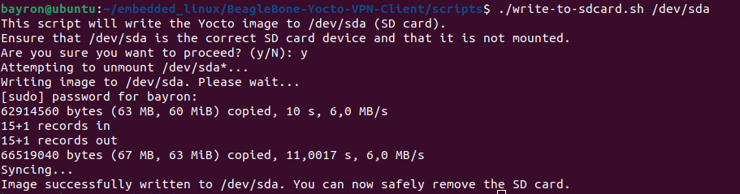

---

## README: Write Yocto Image to SD Card Script

This script facilitates the writing of a Yocto-generated `.wic` image to an SD card, enabling booting on devices like the BeagleBone Black. The updated script allows specifying the target SD card device (e.g., `/dev/sda`, `/dev/sdb`, `/dev/sdc`) as a command-line argument, offering greater flexibility and safety.

### Script Location 
- The Script can be found under `/yocto/scripts` folder 

### Prerequisites

- A Linux-based operating system.
- A generated `core-image-minimal-beaglebone-yocto.wic` file from a Yocto build.
- An SD card connected to your system, correctly identified (e.g., `/dev/sda`). **Warning**: Incorrect identification can lead to data loss.

### How to Use the Script

1. **Prepare the Script**:
   - Ensure `IMAGE_PATH` in the script is pointing to your `.wic` image file.
   - Make the script executable:
     ```bash
     chmod +x write-to-sdcard.sh
     ```

2. **Run the Script with the Target Device as Argument**:
   - Execute the script with the correct device path:
     ```bash
     ./write-to-sdcard.sh /dev/sdx
     ```
     Replace `/dev/sdx` with the actual device path of your SD card (e.g., `/dev/sdb`).

### Important Considerations

- **Data Loss Warning**: The script overwrites all data on the specified device. Confirm the device path carefully to avoid unintended data loss.
- **Device Verification**: Device assignments (e.g., `/dev/sda`, `/dev/sdb`) can change based on the devices connected to your computer. Always verify the correct device path before running the script.
- **Root Privileges**: The script uses `sudo` for operations requiring root access. You might need to enter your password.

### Customization

The script is designed for simplicity and ease of use. However, you can modify the `IMAGE_PATH` variable within the script if your Yocto image is located elsewhere or named differently.


### Liability

By using this script, you assume full responsibility for data safety and device integrity. Always back up important data before proceeding.

### Script Output


---
