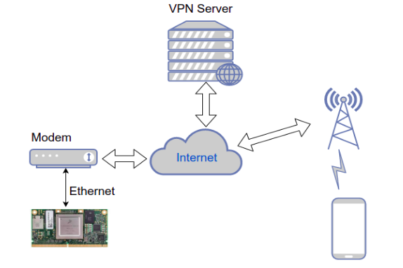

# BeagleBone Yocto VPN Client Documentation

## Overview

Welcome to the repository designed for creating a BeagleBone Black VPN client utilizing a Yocto-based Linux distribution. This project demonstrates how to integrate a BeagleBone Black device with a VPN server to establish remote internet connections. This capability is vital in the realm of modern embedded systems, allowing for secure remote interactions with devices deployed in the field. The VPN server setup is versatile, supporting local servers, cloud-based servers such as AWS EC2, or even another BeagleBone device.

## Getting Started

1. **Project Configuration**: Begin by setting up your development environment with the Visual Studio Code Docker Container Extension.
2. **Building the Base Image**: Follow the instructions in [building-bbb-image.md](Documentation/building-bbb-image.md) to build a `core-image-minimal` for the BeagleBone Black.
3. **Software Package Installation**: With the base image ready, add necessary software packages like OpenVPN, NTP, and OpenSSH as outlined in:
    - [openvpn-installation.md](Documentation/openvpn-installation.md)
    - [openssh-installation.md](Documentation/openssh-installation.md)
    - [ntp-installation-and-setup.md](Documentation/ntp-installation-and-setup.md)

## Internet Connectivity

Ensure your BeagleBone Black is internet-enabled. You can directly connect via Ethernet or enable USB-ETH:

1. **Ethernet Connection**: If available, you can connect the device using an Ethernet cable via a router.
2. **USB-ETH Setup**: For USB-ETH support, refer to the following guides:
    - [enable-usb-eth-gadget-bbb.md](Documentation/enable-usb-eth-gadget-bbb.md) for driver installation
    - [usb-eth-internet-setup.md](Documentation/usb-eth-internet-setup.md) for configuration details

## Image Writing and Booting

For instructions on writing the Yocto image to an SD card and booting it on your BeagleBone Black, consult [write-to-sdcard.md](Documentation/write-to-sdcard.md).

## VPN Server and Client Configuration

To set up and configure the VPN server and client, see [openvpn-server-client-config.md](Documentation/openvpn-server-client-config.md). While AWS EC2 specifics are not covered in full here, ample documentation is available online, including AWS's free tier for testing.

## Automation and Customization

Scripts have been developed to automate many of the setup commands. These are included in a `meta-custom` layer, ensuring the scripts are part of your root file system upon build completion.

## Demonstrations

### Successful Connection between AWS EC2 VPN Server and BeagleBone Client

### Successful SSH Session from AWS EC2 VPN Server to BeagleBone

---

For more detailed information on each step and further documentation, please explore the individual markdown files within the Documentation directory.

## Author

**Bayron Cabrera**

- **GitHub:** https://github.com/bdcabreran
- **LinkedIn:** https://www.linkedin.com/in/bayron-cabrera-517821124/
- **Email:** bayron.nanez@gmail.com
